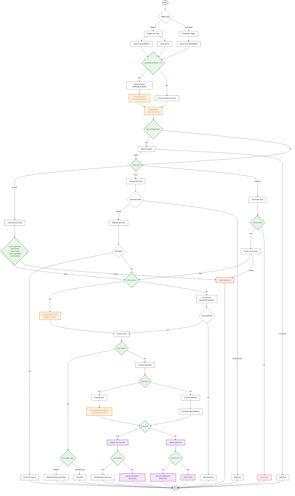

```mermaid
%%{ init: {
    'theme': 'base',
    'themeVariables': {
        'primaryColor': '#ffffff',
        'primaryTextColor': '#000000',
        'primaryBorderColor': '#000000',
        'lineColor': '#000000',
        'secondaryColor': '#ffffff',
        'tertiaryColor': '#ffffff',
        'backgroundColor': '#ffffff',
        'mainBkg': '#ffffff',
        'fontFamily': 'arial'
    }
} }%%

flowchart TD
    %% Entry Points
    Start([Start]) --> TriggerTypes{Trigger Type}
    TriggerTypes -->|Manual| TriggerWithInput[Trigger with Input]
    TriggerTypes -->|Scheduled| TriggerScheduled[Scheduled Trigger]

    %% Query Active Tasks
    TriggerWithInput --> QueryByPattern[Query by EventPattern]
    TriggerWithInput --> QueryById[Query by ID]
    TriggerScheduled --> QueryBySchedule[Query by ScheduledDate]

    %% Task Processing Setup
    QueryByPattern --> WebhookChunkCheck{webhookChunkSize > 0?}
    QueryById --> WebhookChunkCheck
    QueryBySchedule --> WebhookChunkCheck

    %% Chunk Processing
    WebhookChunkCheck -->|Yes| ChunkItems[Chunk Items by webhookChunkSize]
    ChunkItems --> ProcessChunks[Process Chunks<br>with maxConcurrency]
    WebhookChunkCheck -->|No| ProcessAllItems[Process All Items at Once]

    %% CallWebhook Flow - Com controle de concorrência
    ProcessChunks --> CallWebhook[CallWebhook<br>maxConcurrency]
    ProcessAllItems --> CallWebhook

    %% Condition Check
    CallWebhook --> ConditionCheck{Has conditionFilter?}
    ConditionCheck -->|Yes| ValidateCondition[Match Condition]
    ConditionCheck -->|No| TaskTypeCheck
    ValidateCondition -->|Match| TaskTypeCheck
    ValidateCondition -->|No Match| SkipTask[Skip Task] --> End

    %% Task Execution Check
    TaskTypeCheck{Task Type}
    TaskTypeCheck -->|Primary| ValidateTask[Check Execute Task]
    TaskTypeCheck -->|Fork| ForkExecution[Execute Fork Task]
    TaskTypeCheck -->|SubTask| GetParentTask[Get Parent Task]

    %% Task Validation
    ValidateTask --> CheckTaskState{Check Task State<br>- Valid Status<br>- Within Dates<br>- Under repeatMax<br>- Not Running}
    CheckTaskState -->|Valid| ConcurrencyEnabled
    CheckTaskState -->|Invalid| ThrowTaskError[Throw Task Error] --> End

    %% Parent Task Processing
    GetParentTask --> ValidateParent{Parent Valid?}
    ValidateParent -->|Yes| CheckExecuteTask[Check Can Execute]
    ValidateParent -->|No| ThrowError[Throw Error] --> End
    CheckExecuteTask -->|Valid| ConcurrencyEnabled
    CheckExecuteTask -->|Invalid| ThrowTaskError

    %% Concurrency Handling
    ConcurrencyEnabled{Concurrency?}
    ConcurrencyEnabled -->|Yes| DirectExecution[Execute Without Lock<br>Parallel Execution]
    ConcurrencyEnabled -->|No| SetTaskLock[Set PID Lock<br>Sequential Execution]
    SetTaskLock --> CheckLockSuccess{Lock Acquired?}
    CheckLockSuccess -->|Yes| ExecuteTask[Execute Task]
    CheckLockSuccess -->|No| SkipExecution[Skip Execution] --> End
    DirectExecution --> ExecuteTask

    %% Fork Processing
    ForkExecution --> CheckForkMode{Execution Mode}
    CheckForkMode -->|EVENT| RegisterFork[Register Fork Task]
    CheckForkMode -->|SCHEDULED| SkipFork[Skip Fork] --> End
    RegisterFork --> ForkOnlyCheck{Fork Only?}
    ForkOnlyCheck -->|Yes| EndFork[End Fork Process] --> End
    ForkOnlyCheck -->|No| ConcurrencyEnabled

    %% Delay Handling
    ExecuteTask --> DelayCheck{Has Delay?}
    DelayCheck -->|Yes| ExecTypeCheck{Execution Type}
    DelayCheck -->|No| ProcessWebhook[Process Webhook]
    ExecTypeCheck -->|EVENT| RegisterSubTask[Register Delayed SubTask] --> End
    ExecTypeCheck -->|SCHEDULED| SkipDelayTask[Skip Task] --> End

    %% Rule Processing
    ProcessWebhook --> RuleCheck{Has Rule?}
    RuleCheck -->|Yes| ExecuteRule[Execute Rule]
    RuleCheck -->|No| ExecuteWebhook[Execute Webhook]

    %% Webhook Execution
    ExecuteRule --> WebhookExecution[Execute Multiple Webhooks<br>with maxConcurrency] --> ResultHandling
    ExecuteWebhook --> SingleWebhookExec[Execute Single Webhook] --> ResultHandling

    %% Result Processing
    ResultHandling{Success?}
    ResultHandling -->|Yes| UpdateSuccess[Update Task Success]
    ResultHandling -->|No| UpdateError[Update Task Error]

    %% Final States
    UpdateSuccess --> FinalStateCheck{Can Repeat?}
    FinalStateCheck -->|Yes| ScheduleNext[Schedule Next Execution] --> End
    FinalStateCheck -->|No| SetComplete[Set MAX-REPEAT-REACHED] --> End
    UpdateError --> ErrorCheck{Max Errors?}
    ErrorCheck -->|Yes| SetError[Set MAX-ERRORS-REACHED] --> End
    ErrorCheck -->|No| SetActive[Set ACTIVE] --> End

    End([End])

    %% Styling
    classDef process fill:#e3f2fd,stroke:#1565c0,stroke-width:2px,color:#0d47a1
    classDef decision fill:#e8f5e9,stroke:#2e7d32,stroke-width:2px,color:#1b5e20
    classDef state fill:#f3e5f5,stroke:#6a1b9a,stroke-width:2px,color:#4a148c
    classDef error fill:#ffebee,stroke:#c62828,stroke-width:2px,color:#b71c1c
    classDef concurrent fill:#fff3e0,stroke:#e65100,stroke-width:2px,color:#e65100

    class CallWebhook,ProcessChunks,WebhookExecution,DirectExecution concurrent
    class WebhookChunkCheck,TaskTypeCheck,ConcurrencyEnabled,DelayCheck,RuleCheck,ResultHandling,FinalStateCheck,ErrorCheck,ConditionCheck,CheckTaskState,ValidateParent,ExecTypeCheck decision
    class UpdateSuccess,UpdateError,SetComplete,SetError,SetActive state
    class ThrowError,ThrowTaskError error

    %% Add endpoints
    class Start,End terminator
```
